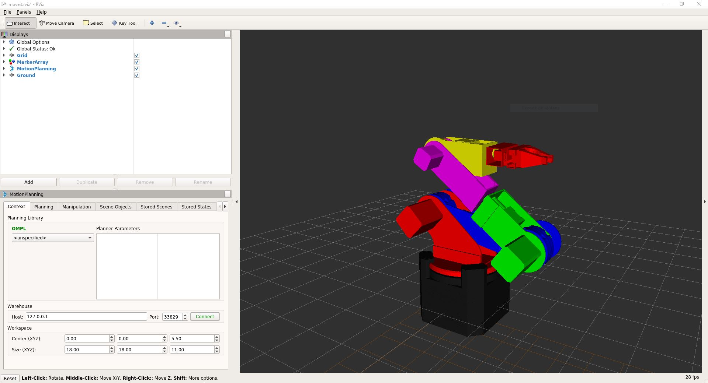

# Brazo_MoveIt
Este repositorio contiene los archivos de MoveIt del brazo de 6 grados de libertad Robocol.

## Paquetes requeridos
Para usar este paquete se requiere tener instalado:
- Ubuntu 18.04:
La instalación de Ubuntu 18.04 se encuentra en el siguiente link:
https://ubuntu.com/download/desktop
- ROS Melodic.  
La instalación de ROS Melodic para Ubuntu 18.04 se encuentra en el siguiente link:  
http://wiki.ros.org/melodic/Installation/Ubuntu
- Moveit.  
La instalación de Moveit se encuentra en el siguiente link: (Se requiere tener ROS para instalar MoveIt)  
http://docs.ros.org/melodic/api/moveit_tutorials/html/doc/getting_started/getting_started.html

## Ejecutar el brazo

```console
foo@bar:~$ roslaunch robocol_new_arm display.launch
```

